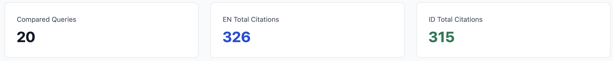
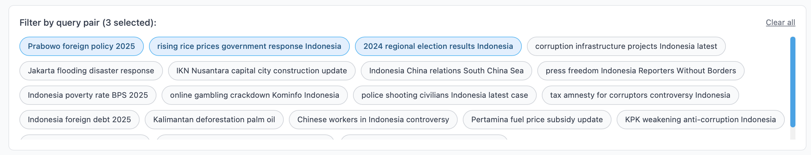
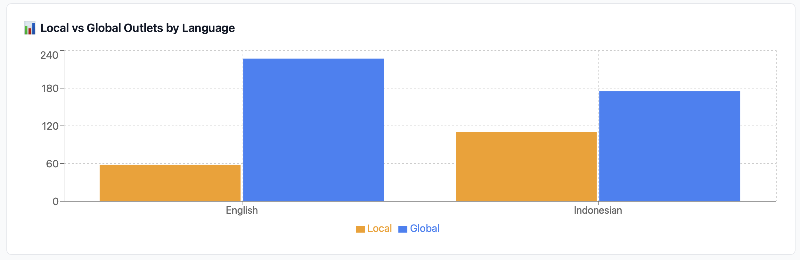
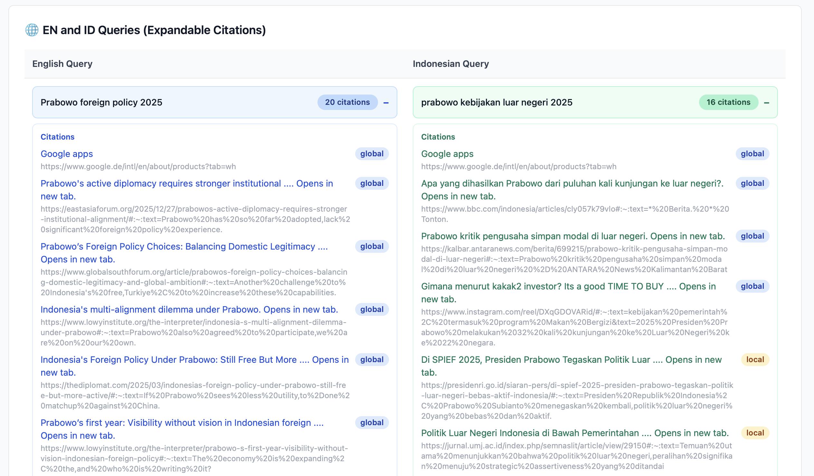

# Language Comparison Tab

The **Language Comparison** tab lets you inspect how Google AI Overviews differ between English and Indonesian versions of the same search queries — specifically which sources are cited and whether they are local or global outlets.

---

## Data model

Comparison data is stored in three Firestore subcollections per user:

| Collection | Contents |
|---|---|
| `users/{uid}/query_pairs` | Pairs linking an EN query string to its ID equivalent |
| `users/{uid}/en` | Per-query citation snapshots for English searches |
| `users/{uid}/id` | Per-query citation snapshots for Indonesian searches |

Each citation carries a `classification` field: `"local"` or `"global"`. The query runner extension writes these collections; the dashboard only reads them.

---

## Summary cards

Three stat cards at the top of the tab give an at-a-glance overview:

- **Compared Queries** — total number of EN/ID pairs loaded
- **EN Total Citations** — sum of all citations across English queries
- **ID Total Citations** — sum of all citations across Indonesian queries

When a query pair filter is active (see below), these cards update to reflect only the selected pairs.

---

## Query pair filter

A pill-style multi-select lets you narrow the tab to one or more specific query pairs. Each pill shows the English query text.

- Selecting pills limits the summary cards, the outlet chart, and the citation table to the chosen pairs.
- **Clear all** resets the filter and restores the global view.
- With no pills selected, all pairs are shown.

---

## Local vs Global Outlets chart

A grouped bar chart compares how many citations per language come from **local** versus **global** outlets.

- **Local** (amber) — sources classified as local news or regional outlets
- **Global** (blue) — sources classified as international/global outlets

The chart reflects the current filter selection.

---

## EN / ID citation table

A side-by-side table lists every query pair. Each row has two columns: the English query (blue) and the Indonesian query (green).

Clicking a query row expands it to show the full citation list for that query.

Each citation entry shows:

- **Label** — link text, clickable if a URL is available
- **URL** — shown in grey below the label
- **Classification badge** — `local` (amber) or `global` (blue)

If a query has no citation data yet (e.g. the runner hasn't scraped it), the cell shows "No citation list available".